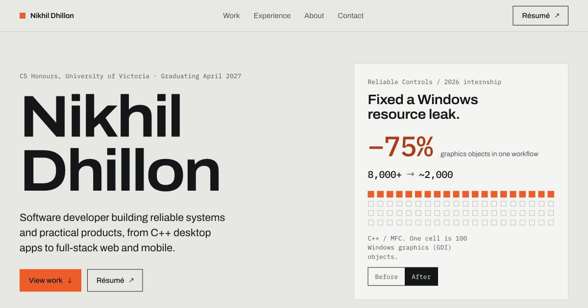

# Nikhil Dhillon — Portfolio

A portfolio for my work across native systems, full-stack products, mobile applications, and backend services.



The homepage provides a quick overview of three selected projects, professional experience, my approach, and contact details. Scroll-linked hero depth, brief desktop project scenes, and an animated experience rail give the page a composed rhythm. Smaller screens use lighter movement and normal flow; reduced-motion preferences provide a static reading path. Four dedicated case studies offer technical depth, including a real DoNext calendar, GROWTH’s scoring formula, and Returnly’s connected workflows. The visual direction uses Archivo, IBM Plex Mono, square frames, and an orange accent in automatic light and dark themes.

## Local development

```sh
npm install
npm run dev
```

```sh
npm run lint
npx tsc --noEmit
npm run build
npm run start
```

To build separately from an existing preview, set `PORTFOLIO_DIST_DIR=.next-verify` for both build and start. Dev previews can use `.next-dev`.

## Structure

- `app/data/portfolio.ts`: project, experience, and profile content
- `app/page.tsx`: concise homepage
- `app/work/[slug]/page.tsx`: static project case studies and metadata
- `app/components/`: shared UI and responsive scroll motion
- `public/work/`: real project evidence

Built with Next.js 15, React 19, TypeScript, Tailwind CSS, and Framer Motion. Native controls, visible focus, a skip link, reduced-motion support, and responsive evidence keep the work accessible to scan and explore.

## Contact

- Email: [nikhilpartapsinghd@uvic.ca](mailto:nikhilpartapsinghd@uvic.ca)
- GitHub: [NikhilDhillon](https://github.com/NikhilDhillon)
- LinkedIn: [Nikhil Dhillon](https://www.linkedin.com/in/nikhil-dhillon-9747341a5/)
