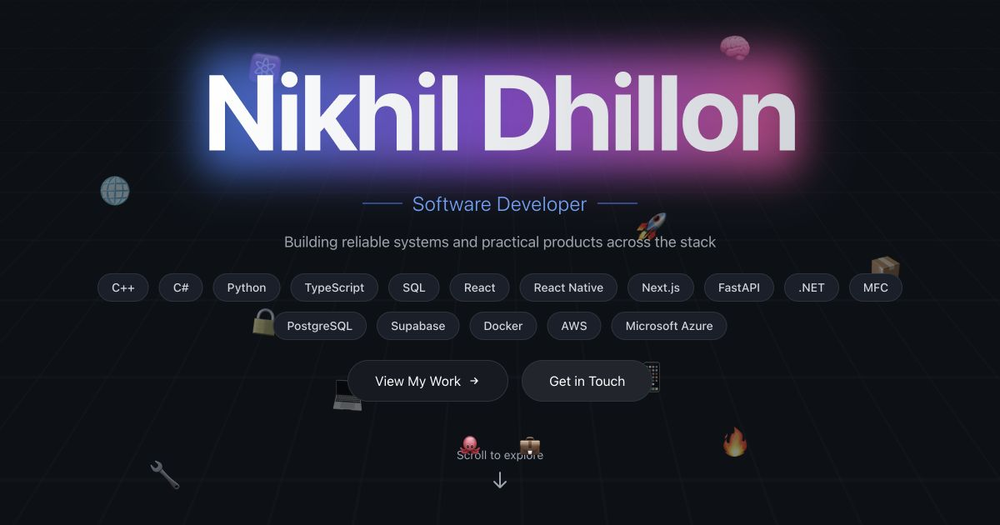

# Nikhil Dhillon — Portfolio

Hi, I'm Nikhil Dhillon, a software developer and Computer Science Honours student at the University of Victoria. I work across native systems, full-stack products, mobile applications, and backend services. This portfolio highlights my experience, technical skills, selected projects, and resume.

## Features

- Responsive design for desktop, tablet, and mobile screens
- Animated hero and experience sections powered by Framer Motion
- Interactive systems, web, mobile, data, and cloud skill cards
- Detailed showcases for DoNext, GROWTH, Returnly, and Wearlyze, plus a broader selection of projects from GitHub
- Direct links to my resume, email, GitHub, and LinkedIn
- Search and social-sharing metadata configured with the Next.js Metadata API

## Built With

- [Next.js 15](https://nextjs.org/) and the App Router
- [React 19](https://react.dev/)
- [TypeScript](https://www.typescriptlang.org/)
- [Tailwind CSS](https://tailwindcss.com/)
- [Framer Motion](https://www.framer.com/motion/)

## Contact

- Email: [nikhilpartapsinghd@uvic.ca](mailto:nikhilpartapsinghd@uvic.ca)
- GitHub: [NikhilDhillon](https://github.com/NikhilDhillon)
- LinkedIn: [Nikhil Dhillon](https://www.linkedin.com/in/nikhil-dhillon-9747341a5/)
